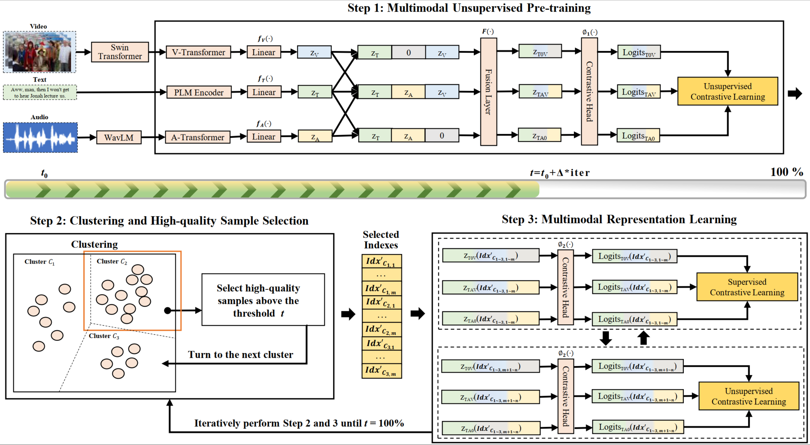
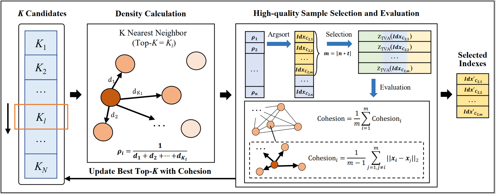

# Unsupervised Multimodal Clustering for Semantics Discovery in Multimodal Utterances

The first unsupervised multimodal clustering method for multimodal semantics discovery. 

## Introduction

This repository contains the official PyTorch implementation of the research paper [Unsupervised Multimodal Clustering for Semantics Discovery in Multimodal Utterances](https://arxiv.org/abs/2405.12775) (Accepted by ACL 2024 Main Conference, Long Paper). 

## Dependencies 

We use anaconda to create python environment and install required libraries: 
```
conda create --name umc python=3.8

pip install torch==1.8.1+cu111 torchvision==0.9.1+cu111 torchaudio==0.8.1 -f https://download.pytorch.org/whl/torch_stable.html

pip install -r requirements.txt
```

## Datasets

### Datasets
- MIntRec: The first multimodal intent recognition dataset ([Paper](https://dl.acm.org/doi/10.1145/3503161.3547906), [Resource](https://github.com/thuiar/MIntRec))
- MELD-DA: A multimodal multi-party dataset for emotion recognition in conversation ([Paper](https://aclanthology.org/P19-1050/), [Resource](https://github.com/declare-lab/MELD))
- IEMOCAP-DA: The Interactive Emotional Dyadic Motion Capture database  ([Paper](https://link.springer.com/article/10.1007/s10579-008-9076-6), [Resource](https://sail.usc.edu/iemocap/))

For MELD-DA and IEMOCAP-DA, we use the well-annotated dialogue act (DA) labels from the EMOTyDA dataset ([Paper](https://aclanthology.org/2020.acl-main.402/), [Resource](https://github.com/sahatulika15/EMOTyDA))

## Features Preparation

You can download the  multimodal features from [Baidu Cloud](https://pan.baidu.com/s/1BE5TI7fyGjoEzvrD_cLXKQ?pwd=swqe) (code: swqe) or [Google Disk](https://drive.google.com/drive/folders/1UiSqfOD3iWNS44PK3at9M0-d-Kwdjnri?usp=sharing).

An example of the data structure of one dataset is as follows:  
```
Datasets/
├── MIntRec/
│ ├── train.tsv
│ ├── dev.tsv
│ ├── test.tsv
│ ├── video_data/
│ │ └── swin_feats.pkl
│ └── audio_data/
│ │ └── wavlm_feats.pkl
├── MELD-DA/
│ ├──..
├── IEMOCAP-DA/
│ ├──...
```
The pre-trained bert model can be downloaded from [Baidu Cloud](https://pan.baidu.com/s/1k1zxK4xh0UyPhOU_-oPlow) with code: v8tk. 

## Models

In this work, we propose UMC, a novel unsupervised multimodal clustering method. It introduces (1) a unique approach to contructing augmentation views for multimodal data, (2) an innovative strategy to dynamically select high-quality samples as guidance for representation learning, (3) a combined learning approach to use both high- and low-quality samples to learn friendly representations conducive to clustering. The model architecture is as follows:  



The high-quality sampling strategy is illustrated as follows:  



## Usage 

Clone the repository: 
```
git clone git@github.com:thuiar/UMC.git
```

Run the experiments by: 
```
sh examples/run_umc.sh
```

## Quick start from Pretrain
**The following example demonstrates a complete quickstart process using the MIntRec dataset.**

Step 1 : Download the dataset and pre-trained BERT model using the provided method, and place them in the `UMC/` directory.

Step 2 : Modify the parameters in `configs/umc_MIntRec.py` to include the pre-training process.
```
'pretrain': [True],
```
Step 3 :You can modify the parameters in the examples/run_umc.sh file to suit your needs as follows:
```
--data_path 'Datasets' \  # Change dataset address/path

--train \  # Include the training process

--save_model \  # Specify to save the model

--output_path "outputs"  # Store both pre-trained and final models
```
Step 4 :Run the experiments by: 
```
sh examples/run_umc.sh
```

## Results

|          | Methods  | NMI   | ARI   | ACC   | FMI   | Avg.  |
|----------|----------|-------|-------|-------|-------|-------|
|**MIntRec** | SCCL     | 45.33 | 14.60 | 36.86 | 24.89 | 30.42 |
|          | CC       | 47.45 | 22.04 | 41.57 | 26.91 | 34.49 |
|          | USNID    | 47.91 | 21.52 | 40.32 | 26.58 | 34.08 |
|          | MCN      | 18.24 | 1.70  | 16.76 | 10.32 | 11.76 |
|          | UMC (Text) | 47.15 | 22.05 | 42.46 | 26.93 | 34.65 |
|          | UMC      | **49.26** | **24.67** | **43.73** | **29.39** | **36.76** |
| **MELD-DA**            | SCCL     | 22.42 | 14.48 | 32.09 | 27.51 | 24.13 |
|          | CC       | 23.03 | 13.53 | 25.13 | 24.86 | 21.64 |
|          | USNID    | 20.80 | 12.16 | 24.07 | 23.28 | 20.08 |
|          | MCN      | 8.34  | 1.57  | 18.10 | 15.31 | 10.83 |
|          | UMC (Text) | 19.57 | 16.29 | 33.40 | 30.81 | 25.02 |
|          | UMC      | **23.22** | **20.59** | **35.31** | **33.88** | **28.25** |
| **IEMOCAP-DA** | SCCL     | 21.90 | 10.90 | 26.80 | 24.14 | 20.94 |
|          | CC       | 23.59 | 12.99 | 25.86 | 24.42 | 21.72 |
|          | USNID    | 22.19 | 11.92 | 27.35 | 23.86 | 21.33 |
|          | MCN      | 8.12  | 1.81  | 16.16 | 14.34 | 10.11 |
|          | UMC (Text) | 20.01 | 18.15 | 32.76 | 31.10 | 25.64 |
|          | UMC      | **24.16** | **20.31** | **33.87** | **32.49** | **27.71** |

## Citations

If you are insterested in this work, and want to use the codes or results in this repository, please **star** this repository and **cite** the following works:
```
@inproceedings{zhang-etal-2024-unsupervised,
    title = "Unsupervised Multimodal Clustering for Semantics Discovery in Multimodal Utterances",
    author = "Zhang, Hanlei  and Xu, Hua  and Long, Fei  and Wang, Xin  and Gao, Kai",
    booktitle = "Proceedings of the 62nd Annual Meeting of the Association for Computational Linguistics",
    year = "2024",
    doi = "10.18653/v1/2024.acl-long.2",
    pages = "18--35"
}
```
```
@inproceedings{10.1145/3503161.3547906,
    author = {Zhang, Hanlei and Xu, Hua and Wang, Xin and Zhou, Qianrui and Zhao, Shaojie and Teng, Jiayan},
    title = {MIntRec: A New Dataset for Multimodal Intent Recognition},
    year = {2022},
    doi = {10.1145/3503161.3547906},
    booktitle = {Proceedings of the 30th ACM International Conference on Multimedia},
    pages = {1688–1697},
    numpages = {10},
}
```
